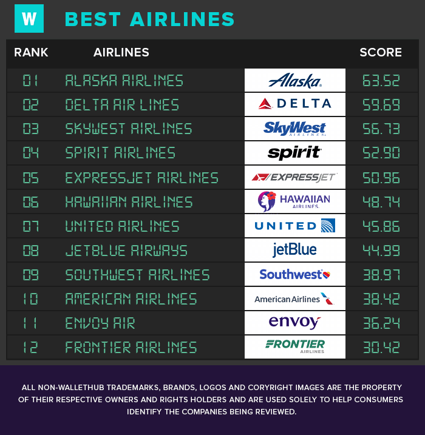

```{r setup, include=FALSE}
knitr::opts_chunk$set(echo = TRUE)

library(leaflet)
library(dplyr)
require(data.table) # v1.9.7
require(feather) # v0.0.0.9000
require(readr) # v0.2.2
library(airportr)
library(tidyr)
library(ggplot2)
library(gganimate)
library(scales)
library(plotly)
library(lubridate)
```

## Overview
The performance of airlines is measured on a yearly basis and ranked from best to worst. Alaska Airlines was regarded as the best airline in America by Wallethub in 2019. On the same list, Frontier ended up in last place. During this project we will be analyzing a subset of this list and look at their 2018 performance, but also take a look into their history and see what we can find there. 

We will be taking a look at five different airlines: 

* Alaska Airlines 
* Delta Air Lines
* United Airlines 
* American Airlines 
* Frontier Airlines

We chose these airlines as they fairly well spread out in the ranking list published by Wallethub, https://wallethub.com/edu/best-airlines/20916/. In addition, Frontier Airlines is a Low-Cost Carrier (LCC) which means that the airline puts high emphasis on minimizing operating costs and providing the cheapest tickets possible. This makes it unique to the other airlines which do not have this business model. 

We will be analyzing each airline on a number of categories:

* Customer reviews
    + Do smaller airline have a higher customer satisfaction? 
    + Does a LCC have a lower customer satisfaction? 
* Number of flights per month
* On-Time performance
* Number of cancelled flights
* Employee treatment
    + Average Annual Salary
    + Employee performance
    + Workload
    
We have also looked at the performance of different American airports, especially regarding the On-Time performance and the number of flights in the year 2018. 

## Related Work
My inspiration for this project comes from an article I have recently come across which had the following airline rating:
{width=50% height=50%}

This ranking is done by Wallethub (https://wallethub.com/edu/best-airlines/20916/) focuses on ticket prices, reliabilty, In-flight comfort and other areas. An area that was not researched was the financial state of each airline and in particular how employees are treated. We want to see if we can replicate these results for the year 2018. Another thing is that this research focused on 2018, while we will also look into the history of these airlines. 

## Initial Question
The initial question that sparked this project is are we able to determine the best or worst airline in America? Just like the related work previously mentioned we will look at the different categories and determine good and bad airlines.

Over the course of this project we have also added in airport performance over 2018. The current implementation forms an introduction and could be used as a point of future work to further analysis the performance of certain airports. 

## Data
Since we have a variety of categories, we have used a number of different data sources and a number of different ways to process the data. 

### Customer Data
To gather the customer data we have scraped the review system of Flightradar24. Reviews can be found for every airline and have a number of categories: 

* Boarding / Deplaning (The process of getting on and off board of an aircraft)
* Flight Crew
* In-Flight Services
* In-Flight Entertainment
* WiFi

An example page for Alaska Airlines: https://www.flightradar24.com/data/airlines/as-asa/reviews

### Flight Data
The flight data is gathered from the Office of Airline Information, Bureau of Transportation Statistics (BTS). The data ranges from 1987 till 2019 and every month comes in the form of a csv file. We have combined these csv files per year and used this to analyze the history. source: https://www.transtats.bts.gov/DatabaseInfo.asp?DB_ID=120&Link=0

Most csv files are large in size, ~500 Mb. Therefore we make use of fread instead of read.csv since it is way faster. 
For cancelled flights we decided to use relative values mainly because all airlines have a different number of total flights. Since a big airline will have more cancelled flights this makes it difficult to have an accurate comparison.  

### Financial Data
The Airline Data Project by the MIT has gathered financial data for most major airlines. We have used a portion of the data they provide to compare the financial state of airlines. The data comes in the form of excel files. source: http://web.mit.edu/airlinedata/www/default.html 

## Exploratory Analysis

All graphs are made with ggplot2 and plotly and fully interactive, you can however over data points to see the exact value and compare them with other airlines. You can make use of the bar below time plots to zoom in on specific time periods. You can do this by dragging the bar from the left and right towards the middle. You can also filter out airlines by clicking them in the legend.
For the interactive airport map you can click on a marker to view more information about each airport. 

```{r child = "customer.Rmd", echo=FALSE, warning = FALSE, message = FALSE, eval = TRUE}

```

```{r child = "airlines1.Rmd", echo=FALSE, warning = FALSE, message = FALSE, eval = TRUE}

```

```{r child = "finances.Rmd", echo=FALSE, warning = FALSE, message = FALSE, eval = TRUE}

```

```{r child = "airport.Rmd", echo=FALSE, warning = FALSE, message = FALSE, eval = TRUE}
```

## Final Analysis
We started this project with the question whether we can find the best and worst airline in America. Looking at all the categories it becomes clear that Frontier Airlines is, with margin, the worst airlines out of all that were analyzed. Having the lowest score in almost every category. 

American Airlines and United Airlines battle it out for third place and it is difficult to name one of these airlines as a clear winner. American Airlines scores better in customer reviews, but worse in the percentage of cancelled flights. United Airlines also outperforms American Airlines when it comes to the employee treatment, offering better wages and salaries and better pension and benefit packages over the last couple of years. So one could say that United Airlines takes third place, but only marginally. 

The title of best airline goes between Alaska Airlines and Delta Air Lines. Both airlines have similar customer review scores, Alaska has a slightly better on-time performance, but relatively more cancelled flights. Delta offers a better average annual wage and salary. Both airlines offer a similar pension and benefit package. The airlines are closely matched and thus we will both name them 'The best Airline of America'.

<iframe width="560" height="315" src="https://youtu.be/kFgBYn8bkSE" frameborder="0" allowfullscreen></iframe>

If the embedded video does not load follow this link: https://youtu.be/kFgBYn8bkSE 